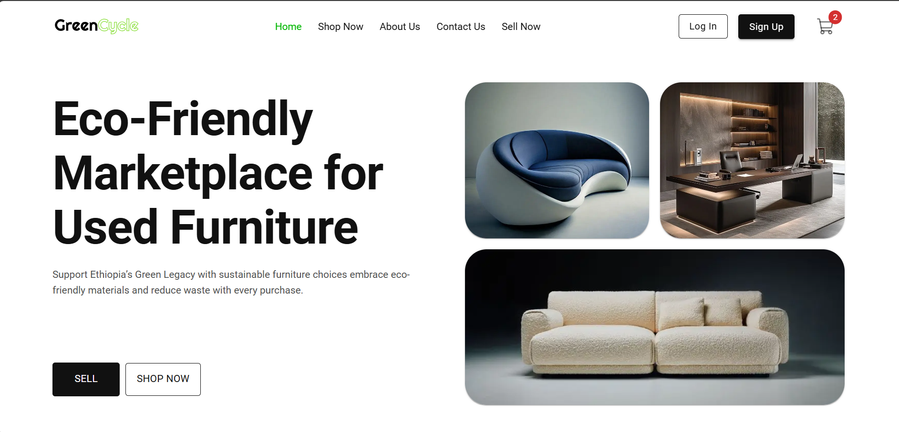
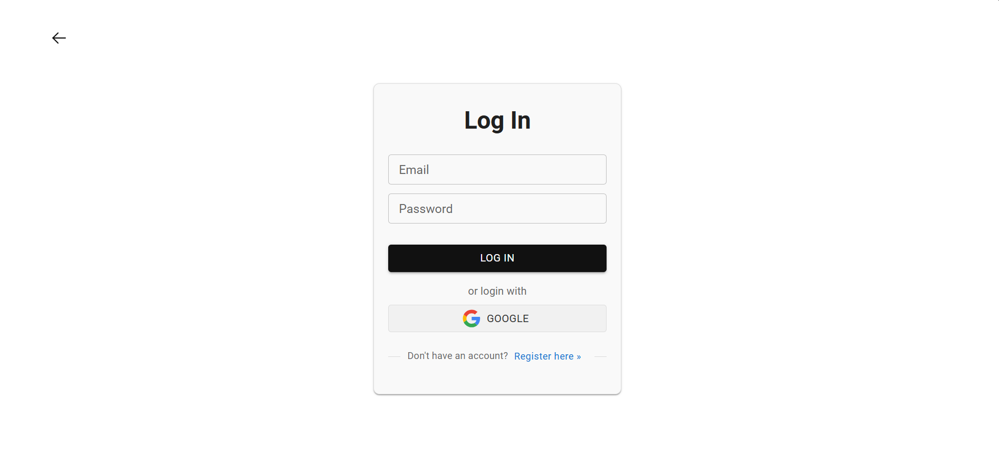
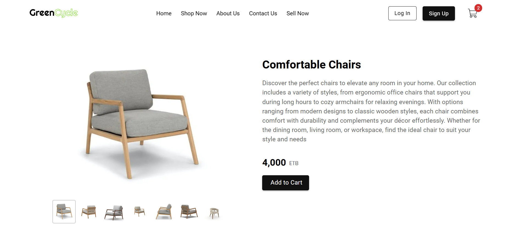
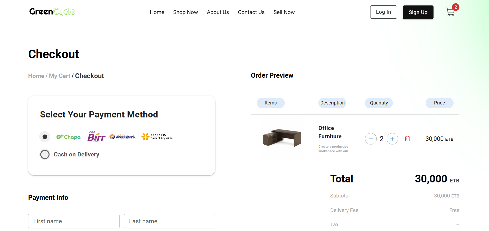
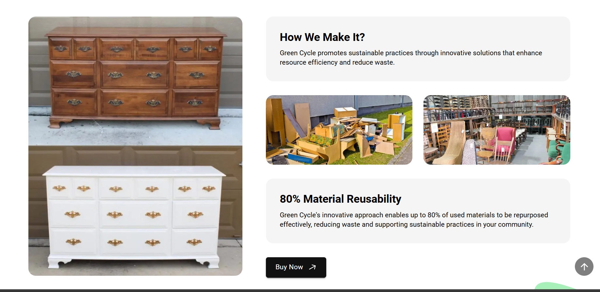
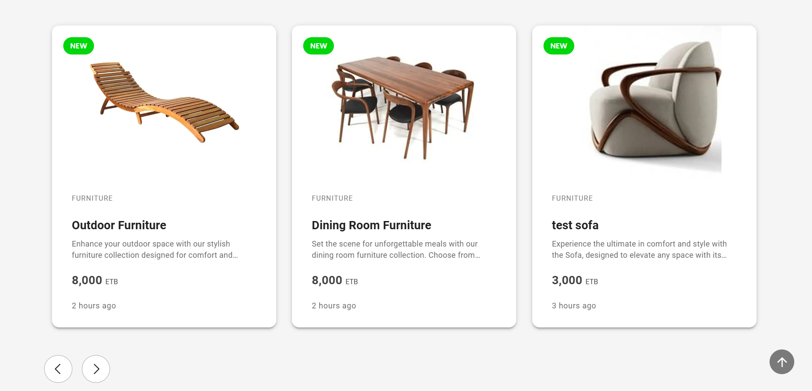

# Green Cycle

Green Cycle is a sustainable furniture reuse platform built with Next.js and MongoDB. It connects buyers and sellers of pre-owned furniture, allowing users to buy, sell, and trade second-hand furniture. The platform features a fully functional admin panel for managing products, users, and orders, and provides a seamless experience across desktop and mobile devices, promoting eco-friendly practices by supporting the reuse of furniture.

## Screenshots of Frontend App








# Green Cycle Documentation

## Table of Contents
1. [Introduction](#introduction)
2. [Technology Stack](#technology-stack)
3. [Project Structure](#project-structure)
4. [Features](#features)
5. [Installation](#installation)
   - [Client Side](#client-side)
   - [Admin Side](#admin-side)
   - [Backend API](#backend-api)
6. [Usage](#usage)
   - [Client Side](#client-side-usage)
   - [Admin Side](#admin-side-usage)
   - [Backend API Usage](#backend-api-usage)
7. [API Documentation](#api-documentation)
8. [Routes and Controllers Overview](#routes-and-controllers-overview)
9. [Contributing](#contributing)
10. [Authors](#authors)
11. [License](#license)

## Introduction
**Green Cycle** is a platform dedicated to promoting sustainability by connecting buyers and sellers of pre-owned furniture. Built using **Next.js** for both the frontend and backend, it serves as a modern, user-friendly solution for the reuse, buy, and sell of second-hand furniture. The application is fully responsive and includes an admin panel to manage products, users, and orders. With **MongoDB** for data storage, **JWT** for secure authentication, and **TypeScript** for type safety, Green Cycle ensures a smooth and secure user experience for both buyers and sellers.

## Features

1. **Furniture Catalog**: Users can browse a variety of pre-owned furniture, each with detailed images, descriptions, and pricing.
2. **Product Listings**: Sellers can list their used furniture with high-quality images and descriptions, making it easy for buyers to find what they need.
3. **Search and Filters**: Advanced search options with filters for categories, price ranges, conditions, and more.
4. **Shopping Cart**: Allows users to add and remove items from the cart before proceeding to checkout.
5. **Secure Checkout**: A smooth, secure checkout process that supports multiple payment methods (credit/debit cards, etc.).
6. **User Accounts**: Users can create accounts to track orders, manage preferences, and save their information for future use.
7. **Admin Panel**: A fully functional admin interface for managing users, products, and orders. Admins can easily monitor platform activities.
8. **Mobile Responsiveness**: Fully optimized for mobile devices, ensuring a seamless experience on smartphones and tablets.
9. **Order Tracking**: Users can track the status of their orders directly on the platform.
10. **Analytics Dashboard**: Admins have access to reports and analytics to monitor platform usage, sales, and inventory.
11. **SEO Optimized**: Designed with SEO best practices in mind to ensure visibility in search engines and attract organic traffic.

---

## Technology Stack

### Frontend and Admin
- **Next.js (TypeScript)**: A React framework for building server-rendered applications with automatic optimizations and static site generation.
- **React.js**: Used for building dynamic, component-based user interfaces.
- **Material UI**: A pre-built component library for React that helps speed up UI development with a modern, responsive design.
- **shadcn**: A utility-first component library used for custom styling and efficient component building.
  
### Backend
- **Next.js (API Routes)**: Next.js allows us to build both the frontend and backend within a single framework. The backend is powered by API routes that handle authentication, product management, user operations, and more.
- **MongoDB**: NoSQL database for flexible data storage, supporting fast reads and writes, ideal for handling large-scale product listings and user accounts.
- **NextAuth (JSON Web Token)**: Secure, stateless authentication for managing user sessions.

### Development Tools
- **TypeScript**: Used throughout the project for type safety, improving developer experience, and ensuring reliable code.
- **Node.js**: Server-side runtime for handling API requests and managing backend logic.

---

## Installation

### Client Side
1. Clone the repository:
   ```bash
   git clone https://github.com/kedabdure/online-shop.git
   ```
2. Navigate to the client directory:
   ```bash
   cd frontend
   ```
3. Install dependencies:
   ```bash
   npm install
   ```
4. Start the client application:
   ```bash
   npm run dev
   ```

### Admin Side
1. Clone the repository:
   ```bash
   git clone https://github.com/kedabdurer/online.git
   ```
2. Navigate to the admin directory:
   ```bash
   cd admin
   ```
3. Install dependencies:
   ```bash
   npm install
   ```
4. Start the admin application:
   ```bash
   npm start
   ```
## Usage

### Client Side Usage

1. **Browsing Products**  
   - Browse through available furniture by category or view all items.
   - Each product includes images, descriptions, price, and stock information.

2. **Product Categories**  
   - Filter products by category to easily find specific types of furniture.

3. **Shopping Cart**  
   - Add items to your cart with one click, and adjust quantities as needed.
   - View cart summary and adjust before proceeding to checkout.

4. **Checkout Process**  
   - Finalize your cart and enter shipping information.
   - Choose a payment method, review your order, and complete the purchase.

5. **User Registration and Login**  
   - Create an account to save order history and track ongoing orders.
   - Log in to access saved addresses and payment options.

6. **Order Placement and Tracking**  
   - Place your order and receive a confirmation email.
   - Track order status through the "My Orders" section, from processing to delivery.

7. **Contact and About Pages**  
   - Visit the Contact page for customer support and inquiries.
   - Learn about the company and its values on the About page.

### Admin Side Usage

1. **Accessing the Admin Panel**  
   - Log in to the admin panel to manage products, users, and orders.

2. **Managing Products**  
   - Add, edit, or delete product listings.

3. **Handling Orders**  
   - View, update, and manage customer orders.

4. **Customer Management**  
   - Manage customer accounts and track their activities.

5. **Regular Maintenance**  
   - Perform routine maintenance tasks like clearing old data or refreshing reports.


### Backend API Usage

## API Documentation
**Base URL**
```
[https://o.app/](https://online-shop-indol-three.vercel.app/)
```
## Routes and Controllers Overview

For This project, based on the **models** we defined (User, Product, Admins, Order), here’s a breakdown of the **routes** you’ll likely need.

### 1. **User Routes and Controller**
The **User model** manages user accounts (e.g., customers and admins). You’ll need routes for authentication and user profile management.

**Routes:**
- **POST** `/api/users/` – Register a new user  
- **POST** `/api/users/` – Authenticate user  
- **GET** `/api/account` – Get logged-in user profile  
- **PUT** `/api/account/:id` – Update user profile  
- **DELETE** `/api/users/:id` – Delete a user (admin only)

### 2. **Product Routes**
The **Product model** will handle product data, like listings and categories.

**Routes:**
- **GET** `/api/products` – Get all products  
- **GET** `/api/products/:id` – Get a single product by ID  
- **POST** `/api/products` – Create a new product (admin only)  
- **PUT** `/api/products/:id` – Update a product (admin only)  
- **DELETE** `/api/products/:id` – Delete a product (admin only)

### 3. **Categoryr**
The **Category model** manages product categories.

**Routes:**
- **GET** `/api/category` – Get all categories
- **POST** `/api/category` – Create a new category
- **GET** `/api/category/:id` – Get a single category by ID
- **PUT** `/api/category/:id` – Update a category by ID
- **DELETE** `/api/category/:id` – Delete a category by ID
- **DELETE** `/api/category` – Delete all categories

### 4. **Order Routes**
The **Order model** tracks customer orders, including order status and history.

**Routes:**
- **POST** `/api/orders` – Place a new order  
- **GET** `/api/orders` – Get all orders (admin only)  
- **GET** `/api/orders` – Get orders for the logged-in user  
- **GET** `/api/orders/:id` – Get a specific order by ID  
- **PUT** `/api/orders/:id` – Update order status (admin only)  
- **DELETE** `/api/orders/:id` – Cancel an order  

## **Additional Considerations**
- **Authentication Middleware**: Implement middleware to safeguard routes (e.g., ensuring only logged-in users can access their cart and only admins can manage product listings).
- **Validation Middleware**: Utilize tools like `Joi` or `express-validator` to ensure that request data is validated properly.

---

## Contributing

We’re excited to have you contribute to our project! Whether it’s fixing bugs, adding new features, or improving the documentation, your help is highly valued. Please follow these guidelines for a seamless contribution process.

#### **Reporting Issues**
If you come across a bug or have a suggestion for a new feature, please open an issue. To make sure it’s handled efficiently:
- **Search Existing Issues**: Before creating a new issue, check if it has already been reported.
- **Provide Comprehensive Information**: When submitting an issue, ensure you include:
  - A clear and descriptive title.
  - Step-by-step instructions to reproduce the problem (if relevant).
  - Any error messages or logs that appear.
  - Details about your environment (e.g., operating system, software version).


## Authors

- **Abdurehim Kedir**: [GitHub](https://github.com/kedabure)
  
## License
Copyright (C) 2024 Green Cycle Licensed under the GPLv3 License
